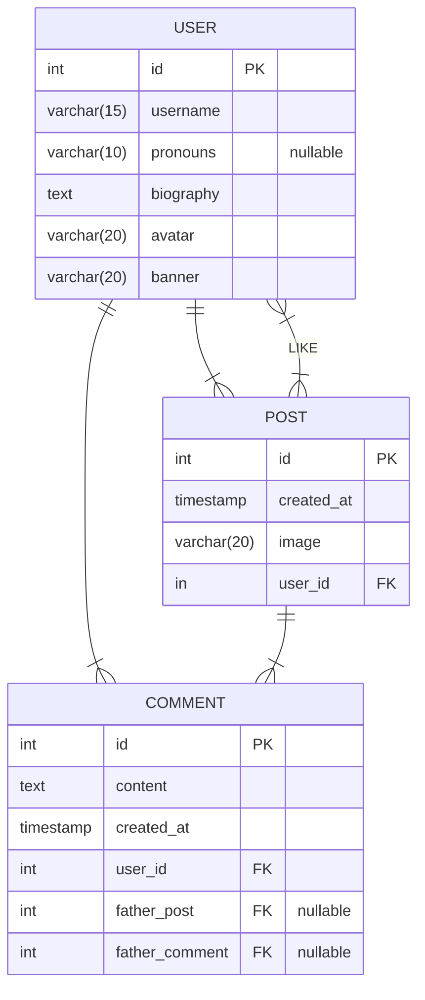

> [!DANGER] Remember
> - The User class is missing some of the fields necessary to store the information returned by OAuth2.0
> - Comments should have either a post or a comment as a parent, but never both 




### Post migration
```php
<?php

use Illuminate\Database\Migrations\Migration;
use Illuminate\Database\Schema\Blueprint;
use Illuminate\Support\Facades\Schema;

return new class extends Migration
{
    public function up(): void
    {
        Schema::create('posts', function (Blueprint $table) {
            $table->id();
            $table->string('image', length: 20);
            $table->unsignedBigInteger('user_id');
            $table->timestamps();
        });
    }
};
```
### Comment migration
```php
<?php

use Illuminate\Database\Migrations\Migration;
use Illuminate\Database\Schema\Blueprint;
use Illuminate\Support\Facades\Schema;

return new class extends Migration
{
    public function up(): void
    {
        Schema::create('comments', function (Blueprint $table) {
            $table->id();
            $table->tinyText('content');
            $table->unsignedBigInteger('user_id');
            $table->string('father_type', length: 10);
            $table->unsignedBigInteger('father_id');
            $table->timestamps();
        });
    }
};
```
